# Real-Time Animal Detection

A sophisticated AI-based system developed to detect animals in real-time through image or video input. This project combines the power of YOLOv10 (You Only Look Once) object detection with a modern web interface, making it accessible for various applications including wildlife monitoring, security, and research.

## Table of Contents
- [Introduction](#introduction)
- [System Architecture](#system-architecture)
  - [Main Application Structure](#main-application-structure)
  - [Flask Initialization](#flask-initialization)
  - [Detection Class](#detection-class)
  - [Detection Methods](#detection-methods)
- [Features](#features)
- [Performance Metrics](#performance-metrics)
  - [Custom Model based on YOLOv10-N (30 Epochs)](#custom-model-based-on-yolov10-n-30-epochs)
  - [Custom Model based on YOLOv10-B (15 & 20 Epochs)](#custom-model-based-on-yolov10-b-15--20-epochs)
- [System Requirements](#system-requirements)
  - [Hardware Requirements](#hardware-requirements)
  - [Software Requirements](#software-requirements)
- [Installation](#installation)
- [Usage](#usage)
- [Project Structure](#project-structure)
- [Training Custom Models](#training-custom-models)
- [Known Limitations](#known-limitations)
- [Acknowledgments](#acknowledgments)

## Introduction

This project was developed as part of a Python with Artificial Intelligence course, demonstrating the practical application of modern AI techniques in real-world scenarios. The system leverages:

- **YOLOv10**: A state-of-the-art object detection model, custom trained for animal detection
- **Flask Backend**: A lightweight Python web framework enabling efficient integration of the ML model
- **Modern Frontend**: Built with HTML, CSS, and JavaScript for seamless user interaction
- **Real-time Processing**: Capable of processing both uploaded media and live webcam feeds

The system is designed to operate in diverse environments with minimal human intervention, making it suitable for wildlife monitoring, research, and security applications.

## System Architecture

The application is built with a modular architecture focusing on maintainability and scalability:

### Main Application Structure
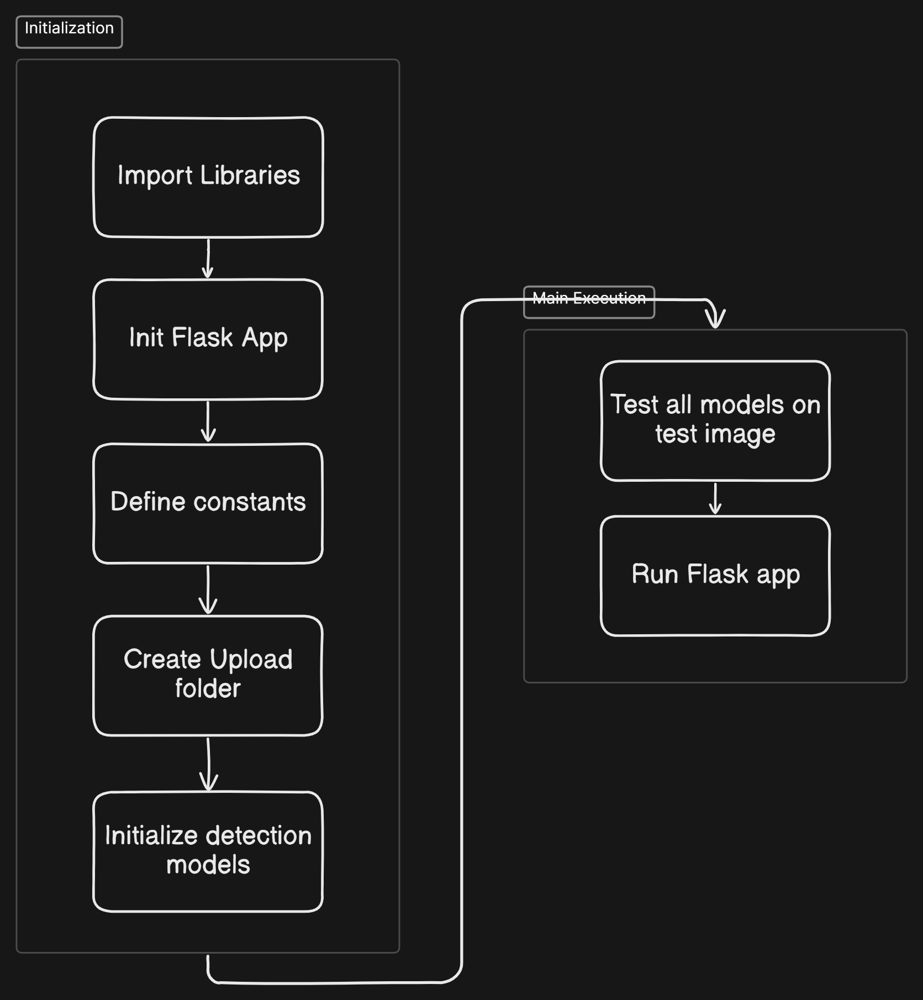
The main application orchestrates the interaction between different components, handling user requests and coordinating the detection process.

### Flask Initialization
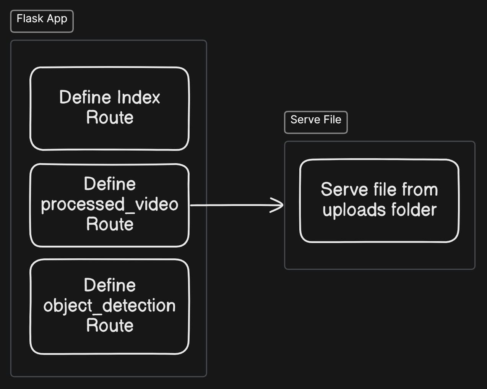
The Flask application setup includes route definitions and configuration management for handling web requests and serving responses.

### Detection Class
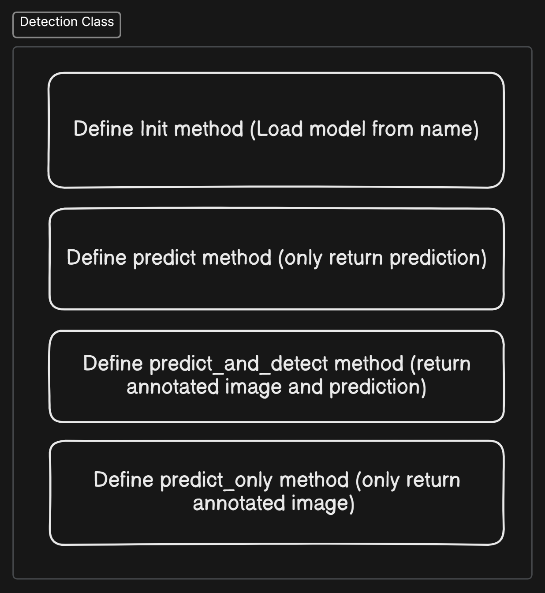
The core detection class encapsulates the YOLOv10 model functionality, providing a clean interface for object detection operations.

### Detection Methods
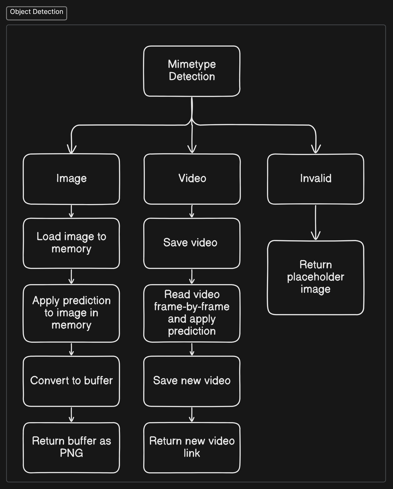
Implementation of detection methods for both image and video processing, including real-time detection capabilities.

## Features

- Real-time animal detection through webcam feed
- Support for image and video file uploads
- Multiple YOLOv10 model variants:
  - Pre-trained models (yolov10n/s/m/b/l/x)
  - Custom-trained models (30-epoch and 15/20-epoch variants)
- Interactive web interface with split view for:
  - File upload and processing
  - Live webcam detection
- Modern UI with responsive design

## Performance Metrics

The project includes performance evaluations for different model configurations:

### Custom Model based on YOLOv10-N (30 Epochs)
- Optimized for speed while maintaining acceptable accuracy
- Suitable for real-time applications
- Performance metrics:
  - 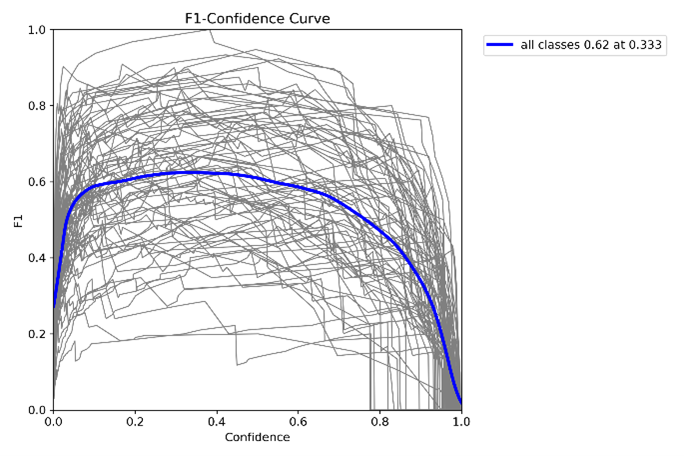
  - 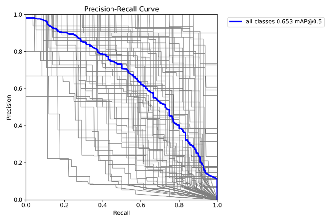
  - 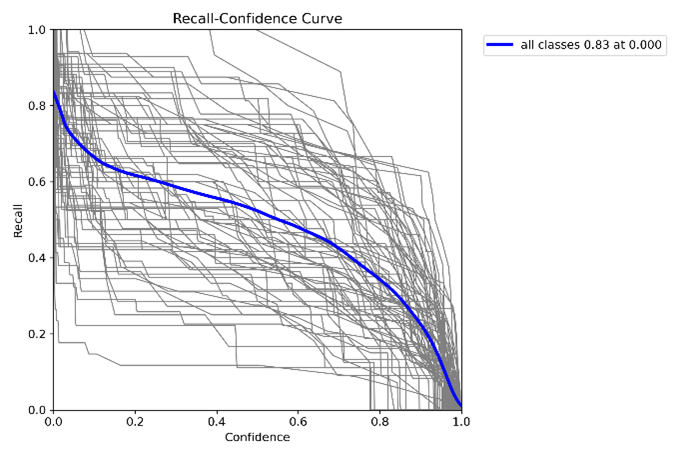
  - 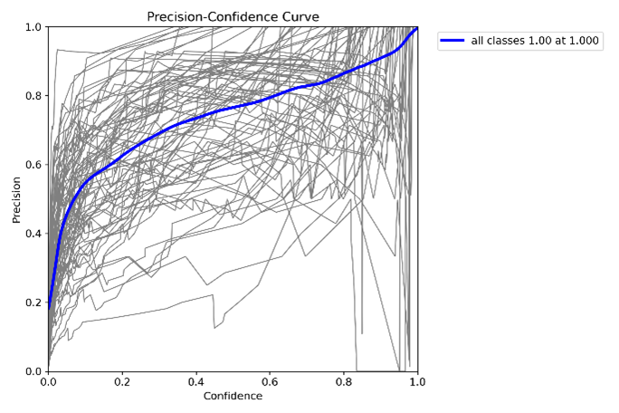
  - 

### Custom Model based on YOLOv10-B (15 & 20 Epochs)
- Balanced model offering good accuracy-speed trade-off
- Two training configurations for comparison:
  
  15 Epochs:
  - 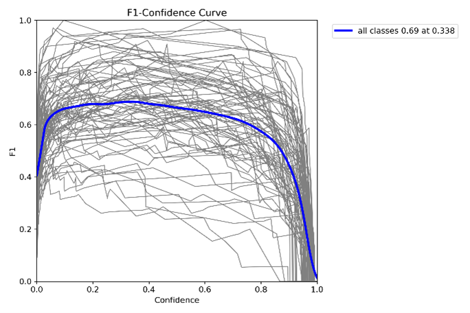
  - 
  - 
  - 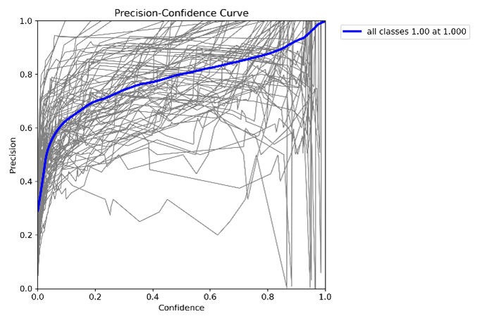
  - 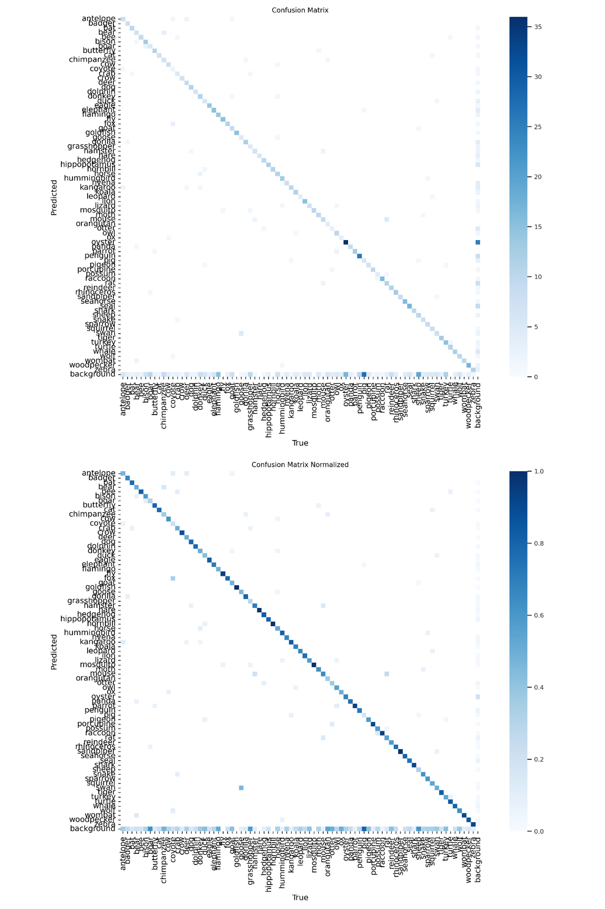
  
  20 Epochs:
  - 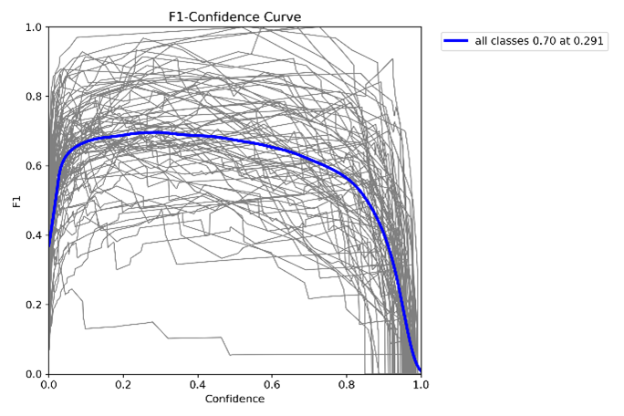
  - 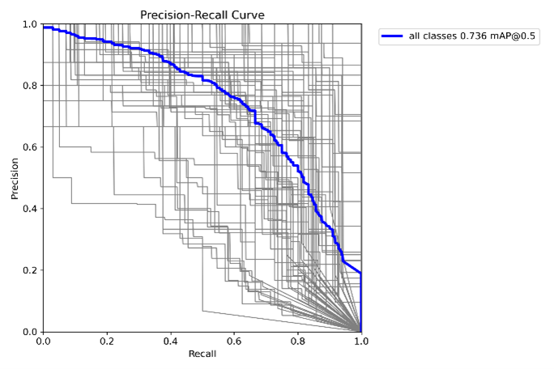
  - 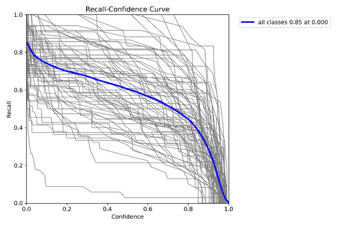
  - 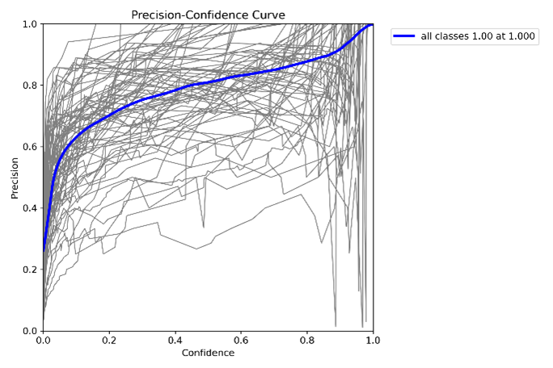
  - 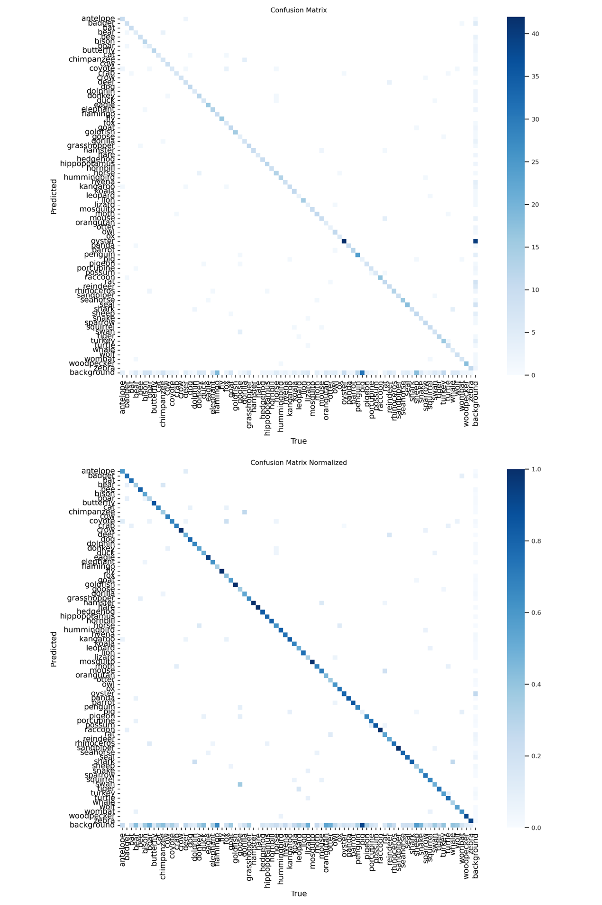

## System Requirements

### Hardware Requirements
- **For Training**:
  - 16GB+ RAM (Tested on 13GB and 16GB)
  - GPU with 16GB VRAM (Tested on T4-16GB)
  - 10th generation processor or newer (Tested on 13th gen i7)
  - 4th generation processor or newer for Ryzen Series Processor (Tested on 4th gen (4800h) ryzen 7)
  - Minimum 16 core processor (Originally used 8 core processor due to resource constraints)
  - CUDA-compatible GPU recommended

### Software Requirements
- **For Deployment**:
  - Ubuntu/Ubuntu on WSL2 (recommended for native CUDA support)
  - CUDA libraries for NVIDIA GPU support
  - Python 3.8+ with pip
  - Modern web browser
- **For Development**:
  - IDE with Python and HTML/CSS/JS support (e.g., VSCode with extensions)
  - Git for version control

## Installation

1. Clone the repository:
```bash
git clone https://github.com/EPFPhmiw47mosLJR/realtime-animal-detection.git
cd realtime-animal-detection
```

2. Create and activate a virtual environment (recommended):
```bash
python -m venv venv
# On Windows
venv\Scripts\activate
# On Unix/MacOS
source venv/bin/activate
```

3. Install dependencies:
```bash
pip install -r requirements.txt
```

## Usage

1. Start the Flask application:
```bash
python website_v10/app.py
```

2. Open web browser and navigate to:
```
http://localhost:8000
```

3. Use the application:
   - Left panel: Upload images or videos for detection
   - Right panel: Use your webcam for real-time detection
   - Select different models using the dropdown menu

## Project Structure

```
realtime-animal-detection/
├── website_v10/
│   ├── app.py              # Main Flask application
│   ├── static/             # Static assets (CSS, images)
│   └── templates/          # HTML templates
├── weights/                # YOLOv10 model weights
└── requirements.txt        # Python dependencies
```

## Training Custom Models

The project includes a Jupyter notebook (`ANIMAL_DETECTION_YOLOv10.ipynb`) for training custom YOLOv10 models. The training process involves:

1. **Data Preparation**:
   - Using Roboflow for image annotation and dataset management
   - Manual annotation of animal bounding boxes
   - Dataset export in YOLOv8 format

2. **Training Environment**:
   - Google Colab with T4-16GB GPU
   - Required libraries: ultralytics, roboflow
   - Automated process for downloading modules, images, and weights

3. **Model Training**:
   - Multiple epoch configurations (15, 20, and 30 epochs)
   - Various model architectures (YOLOv10n/s/m/b/l/x)
   - Focus on balancing accuracy and performance

4. **Challenges Addressed**:
   - Environmental factors (lighting, weather conditions)
   - Data quality and annotation accuracy
   - Bias management in training data
   - Device limitations and optimization

The notebook format allows for efficient development, enabling partial execution and state preservation during the training process.

## Known Limitations

- Environmental factors like lighting conditions and weather can affect detection accuracy
- Detection performance may vary based on device capabilities
- Model accuracy depends on the quality and diversity of training data
- Mobile devices may experience reduced performance due to limited computational resources (ex: laptops)

## Acknowledgments

- [YOLOv10](https://github.com/THU-MIG/yolov10) for the object detection models
- [Ultralytics](https://github.com/ultralytics/ultralytics) for the YOLOv8 framework
- [Flask](https://flask.palletsprojects.com/) for the web framework
- [Roboflow](https://roboflow.com/) for dataset management and annotation tools
- [Kaggle](https://www.kaggle.com/datasets/iamsouravbanerjee/animal-image-dataset-90-different-animals) for the animal image dataset

## Built by

* [Rajnath Singh] (https://github.com/EPFPhmiw47mosLJR)

* [Rajarshya Singh Mahal] (https://github.com/Raj-6660)

