# Real-Time Animal Detection and Classification System

A powerful AI-based web application built to detect and classify animals in real-time across 78 species through image, video, or live webcam input.
This system combines YOLOv10 (You Only Look Once) object detection with a Flask backend and a web interface, designed primarily for livestock protection and wildlife monitoring.

## Table of Contents
- [Introduction](#introduction)
- [System Architecture](#system-architecture)
  - [Main Application Structure](#main-application-structure)
  - [Flask Initialization](#flask-initialization)
  - [Detection Class](#detection-class)
  - [Detection Methods](#detection-methods)
- [Features](#features)
- [Performance Metrics](#performance-metrics)
  - [Custom Model based on YOLOv10-N (30 Epochs)](#custom-model-based-on-yolov10-n-30-epochs)
  - [Custom Model based on YOLOv10-B (15 & 20 Epochs)](#custom-model-based-on-yolov10-b-15--20-epochs)
- [System Requirements](#system-requirements)
  - [Hardware Requirements](#hardware-requirements)
  - [Software Requirements](#software-requirements)
- [Installation](#installation)
- [Usage](#usage)
- [Project Structure](#project-structure)
- [Training Custom Models](#training-custom-models)
- [Future Scope](#future-scope)
- [Known Limitations](#known-limitations)
- [Acknowledgments](#acknowledgments)

## Introduction

This project demonstrates the application of AI techniques to detect and classify animals in real-time, intended for scenarios such as:
- Livestock farm perimeter monitoring
- Early identification of wildlife near human settlements

Built using:

- **YOLOv10**: A state-of-the-art object detection model, custom trained on 78 animal classes
- **Flask Backend**: For lightweight server-side management.
- **Frontend**: **HTML**, **CSS**, and **JavaScript** for seamless user interaction
- **Real-time Processing**: Live webcam feed and uploaded media detection

The system is highly modular and adaptable for future hardware integrations.

## System Architecture

The application is built around modular, scalable components.

### Main Application Structure
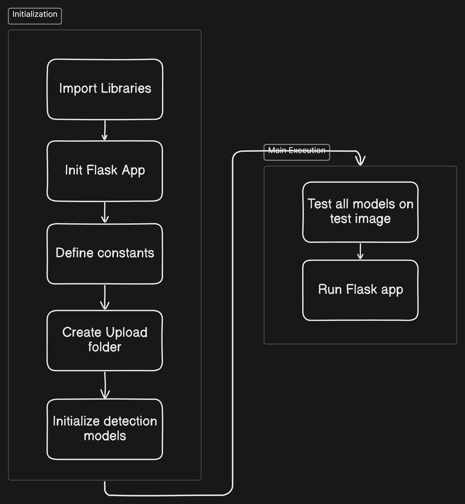
The main Flask server coordinates between the frontend interface and the YOLOv10 object detection engine.

### Flask Initialization
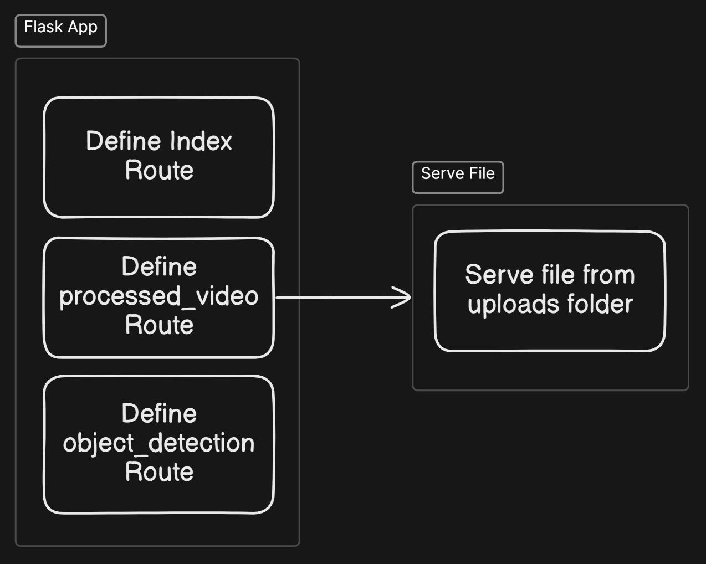
Includes route definitions for uploading media, starting live detection, and serving processed output.

### Detection Class
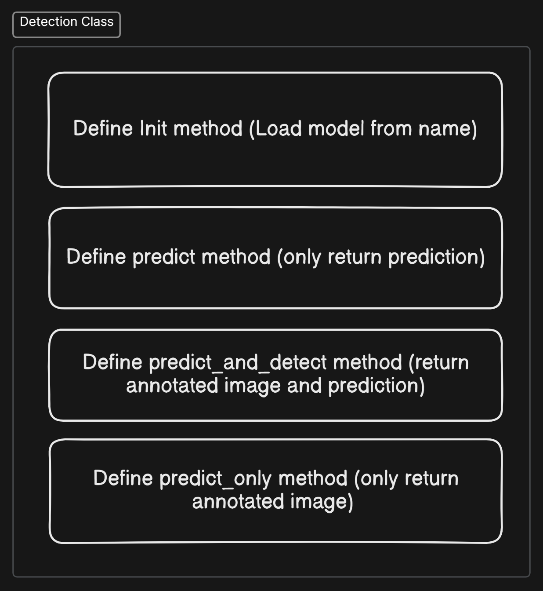
Handles model loading, image pre-processing, running inference, and output post-processing.

### Detection Methods
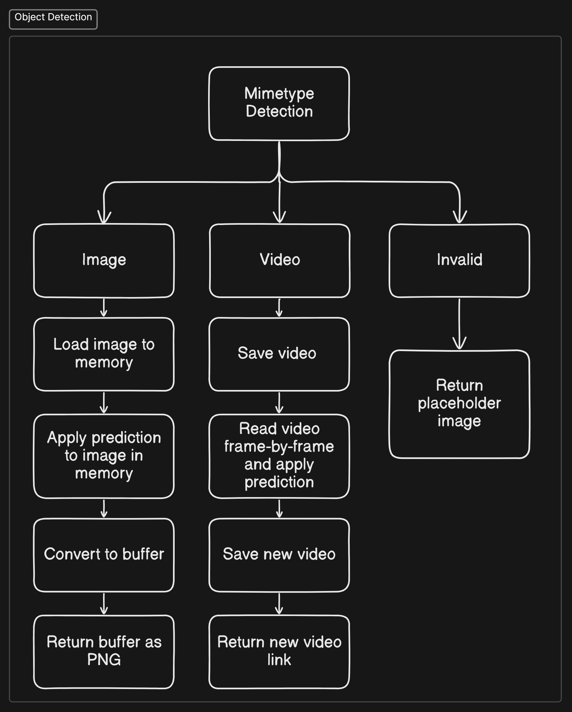
Supports:

- Image Upload Detection

- Video Upload Detection

- Live Webcam Feed Detection

## Features

- Real-time animal detection and classification
- Support for webcam, image and video input.
- Multiple YOLOv10 model variants:
  - Pre-trained models (yolov10n/s/m/b/l/x)
  - Custom-trained models (30-epoch and 15/20-epoch variants)
- Split view web interface for:
  - File upload and processing
  - Live webcam detection
- Model selection dropdown for easy switiching.
- Future-ready for hardware integration.

## Performance Metrics

Custom model evaluations based on YOLOv10 variants:

### YOLOv10-N (30 Epochs)
- Optimized for speed while maintaining acceptable accuracy
- Focused on real-time responsiveness
- Performance visualizations:
  - 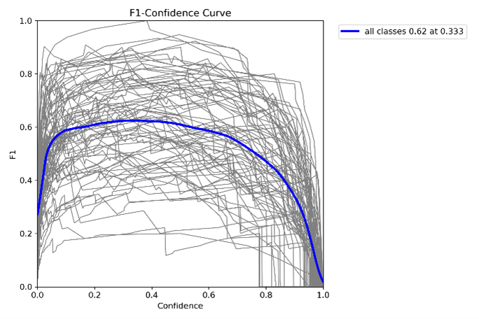
  - 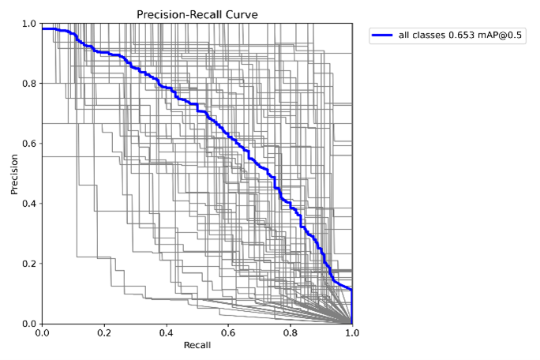
  - 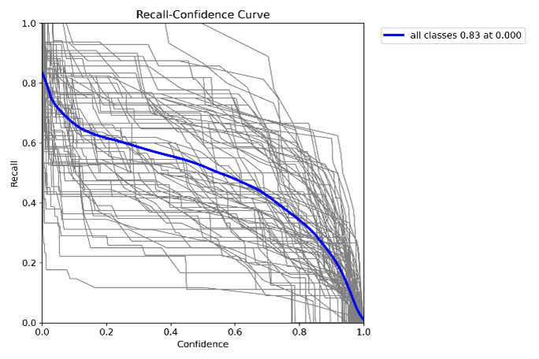
  - 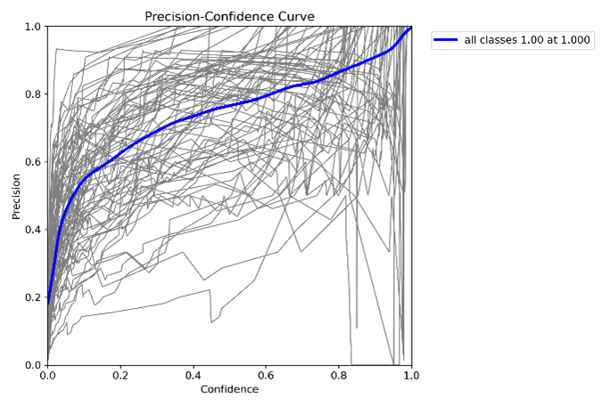
  - 

### YOLOv10-B (15 & 20 Epochs)
- Balanced model offering good accuracy-speed trade-off
- Two training configurations for comparison:
  
  15 Epochs:
  - 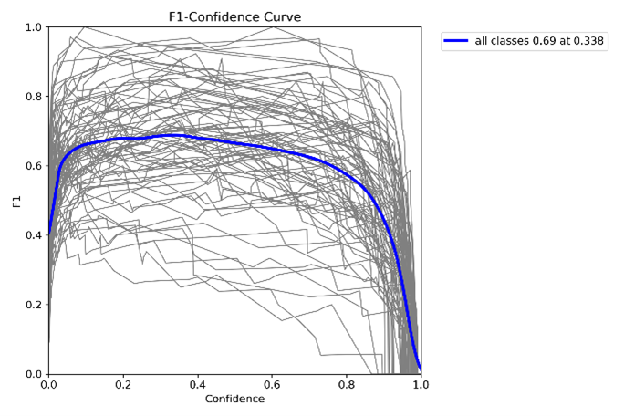
  - 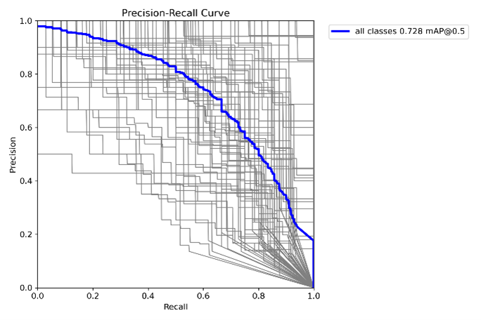
  - 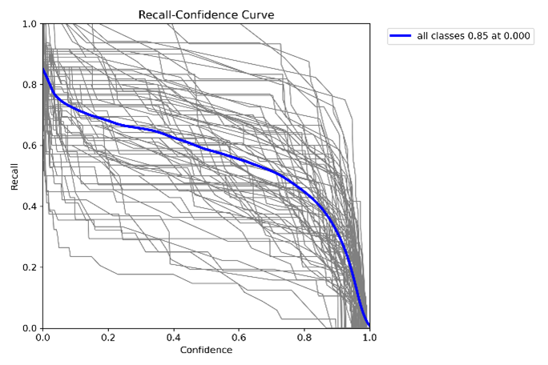
  - 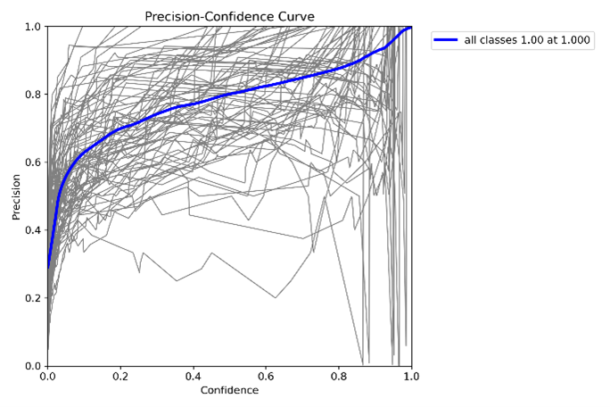
  - 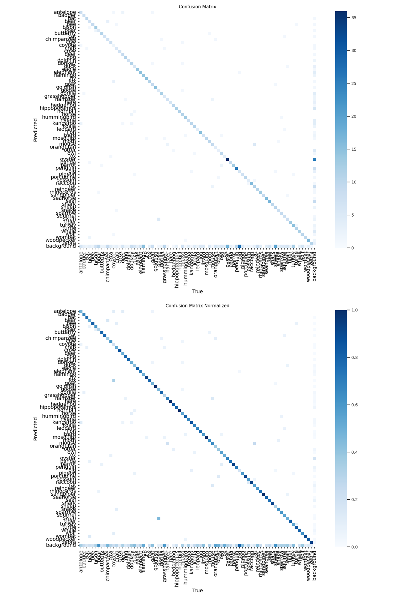
  
  20 Epochs:
  - 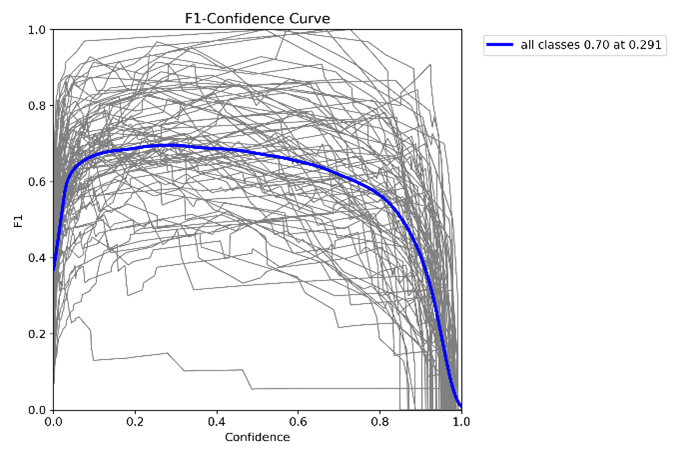
  - 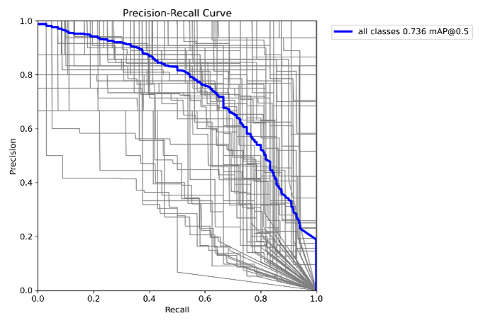
  - 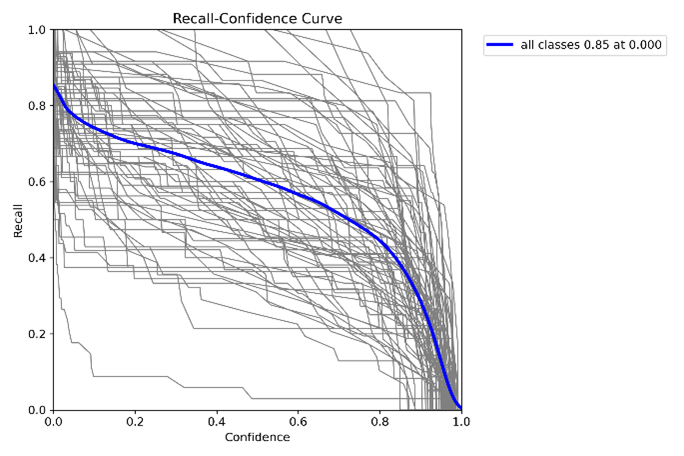
  - 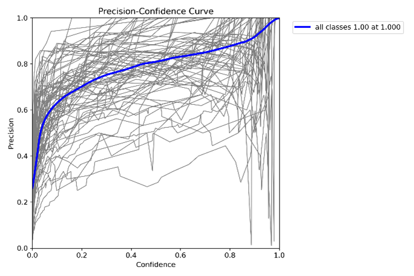
  - 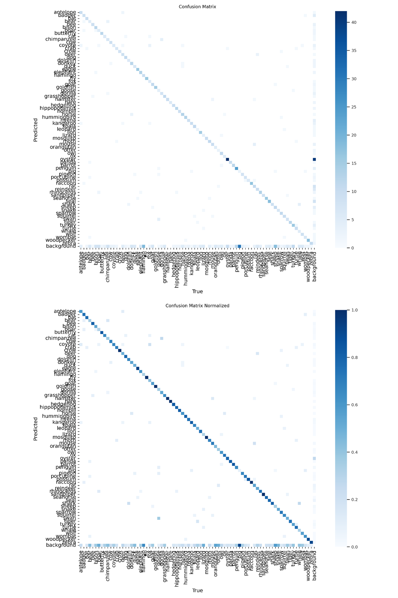

## System Requirements

### Hardware
- **Training**:
  - 16GB+ RAM
  - GPU with 16GB+ VRAM 
  - 10th Gen Intel or 4th Gen Ryzen CPU and above.
  - CUDA-compatible GPU recommended

### Software
- **Deployment**:
  - Ubuntu or WSL2 (recommended for CUDA)
  - CUDA libraries for NVIDIA GPU support
  - Python 3.8+
  - Modern web browser
- **For Development**:
  - IDE with Python and HTML/CSS/JS support (e.g., VSCode with extensions)
  - Git for version control

## Installation

1. Clone the repository:
```bash
git clone https://github.com/EPFPhmiw47mosLJR/realtime-animal-detection.git
cd realtime-animal-detection
```

2. Create and activate a virtual environment (recommended):
```bash
python -m venv venv
# On Windows
venv\Scripts\activate
# On Unix/MacOS
source venv/bin/activate
```

3. Install required dependencies:
```bash
pip install -r requirements.txt
```

## Usage

1. Start the Flask server:
```bash
python website_v10/app.py
```

2. Open web browser and access the application at:
```
http://localhost:8000
```

3. Use the application:
   - Left panel: Upload images or videos for detection
   - Right panel: Use your webcam for real-time detection
   - Drpdown Menu: Switch between available YOLOv10 models

## Project Structure

```
realtime-animal-detection/
├── website_v10/
│   ├── app.py              # Main Flask application
│   ├── static/             # Static assets (CSS, images)
│   └── templates/          # HTML templates
├── weights/                # YOLOv10 model weights
└── requirements.txt        # Python dependencies
```

## Training Custom Models

The project includes a Jupyter notebook (`ANIMAL_DETECTION_YOLOv10.ipynb`) that details the full training pipeline.

1. **Dataset Preparation**:
   - Using Roboflow for image annotation and dataset management
   - Manual annotation of animal bounding boxes
   - Dataset export in YOLOv8 format

2. **Training Environment**:
   - Google Colab with T4-16GB GPU
   - Required libraries: ultralytics, roboflow
   - Automated process for downloading modules, images, and weights

3. **Model Training**:
   - Multiple epoch configurations (15, 20, and 30 epochs)
   - Various model architectures (YOLOv10n/s/m/b/l/x)
   - Focus on balancing accuracy and performance

4. **Challenges Addressed**:
   - Data quality and annotation accuracy
   - Bias management in training data
   - Device limitations and optimization

The notebook format allows for efficient development, enabling partial execution and state preservation during the training process.

## Future Scope
- Integration with real-world IoT hardware like smart surveillance cameras and autonomous drones
- Automatic threat classification (e.g., predator vs harmless)
- Mobile device optimization for farm owners
- Extended dataset for rare/localized wildlife species

## Known Limitations

- Detection accuracy may vary with poor lighting/weather conditions
- Webcam latency on low-resource devices
- Current version identifies species, not threat levels
- Mobile devices may experience reduced performance due to limited computational resources
- Requires a stable local server setup for best real-time performance

## Acknowledgments

- [YOLOv10](https://github.com/THU-MIG/yolov10) for the object detection models
- [Ultralytics](https://github.com/ultralytics/ultralytics) for the YOLOv8 framework
- [Flask](https://flask.palletsprojects.com/) for the web framework
- [Roboflow](https://roboflow.com/) for dataset management and annotation tools
- [Kaggle](https://www.kaggle.com/datasets/iamsouravbanerjee/animal-image-dataset-90-different-animals) for the animal image dataset

## Built by

* [Rajnath Singh] (https://github.com/EPFPhmiw47mosLJR)

* [Rajarshya Singh Mahal] (https://github.com/Raj-6660)

